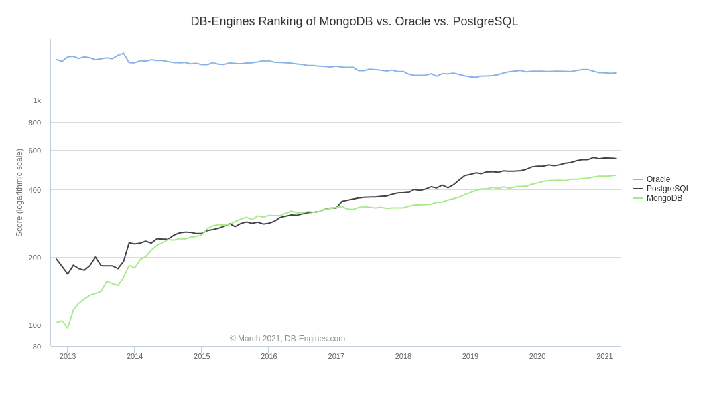

# Lecture  12: The Rise of NoSQL - MongoDB (MongoDB v.s. PostgreSQL JSONb data type) 

## Reading
		
Please go and read about a conversion from MongoDB to PostgreSQL:
[https://developer.olery.com/blog/goodbye-mongodb-hello-postgresql/](https://developer.olery.com/blog/goodbye-mongodb-hello-postgresql/)

## Why talk about MomgoDB

Growth of databases and (decline) is probably the biggest reason.  An article on LinkedIn reports, "the most sought after database skills 
are PostgreSQL and MongoDB".

This is why:

When you go looking at other databases, MySQL is decreasing slowly in usage, Microsoft SQL Server is falling fast - at it's current
rate it will a minor player in 3 to 4 years.  There are a raft of other SQL databases, DB2 from IBM and the Unix version of it, DB2 Universal,
Ingres, RBAse etc.  All minor players.

There are a slew of NO-SQL databases - but the only 2 that have significant usage are MongoDB and Redis.  Redis is an in-memory
shared data structure - we will get back to it some later in the semester - it is very useful - as a compliment to a lot of
systems.

So... PostgreSQL and MongoDB are the two that are growing.

## What is good about MongoDB

Why are people using it - why is it growing.

1. It is JavaScript and JSON all the way down.  Front end devs are use to JavaScript.
2. It has simple setup.  (this turns out to be a mixed blessing)
3. You can learn it in 1 hr.
4. Automatic indexing.
5. It's the "trendy" thing.

## What is bad about MongoDB

Why to choose some other system.

1. It has simple setup.  The setup ignores all security and network setup.  Lot's of folks
in this class are now aware of just how complex that can be.
2. Performance scales linearly with replicas is the claim.  It is mostly true.  The difference
is that 3,000 to 4,000 documents per second doubling with a replica is still way less than
PostgreSQL running at 50,000 per second for a single system and scaling to over 1,000,000 
per second (Amazon Aurora).
3. A number of the "features" are really week.  MongoDB offers a Geographic Information System (GIS) package
but the polygons lack the ability to have holes or be dis-continuous.   Lot's of real world GIS stuff
need holes.  PostGIS -the GIS system on top of PostgreSQL has all of these hard to implement 
features. (We will get do do a little bit on PostGIS before the end of the semester)
4. Automatic indexing. - What happens when you don't need the index any more.  You can get rid of
it but MongoDB seems to only remove the index form it's catalog - but not reclaim the space.
5. Horrible recovery and batch times.   I have recovers indexes that take hours and the entire
database is locked.  I have done bulk loads that take hours and the entire system is locked.

