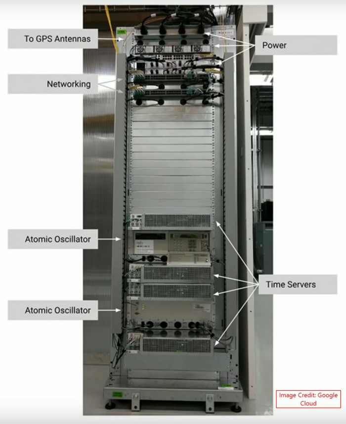

# Lecture 15 - Google's F1 Database

[Google F1 - https://youtu.be/94_mv19gHxs](https://youtu.be/94_mv19gHxs) 
[Byzantine Generals - https://youtu.be/EioBX3K7Frw](https://youtu.be/EioBX3K7Frw) 
[Google F1 pt2 - https://youtu.be/CCyyFJRDFrU](https://youtu.be/CCyyFJRDFrU) 
[Walk through of Front End - https://youtu.be/CCyyFJRDFrU](https://youtu.be/CCyyFJRDFrU) 

From Amazon S3 - for download (same as youtube videos)

[Google F1](http://uw-s20-2015.s3.amazonaws.com/4820-L15-pt1-Google-F1.mp4) 
[Byzantine Generals](http://uw-s20-2015.s3.amazonaws.com/4820-L15-pt2-Byzantine-Fault-Tollerance.mp4) 
[Google F1 pt2](http://uw-s20-2015.s3.amazonaws.com/4820-L15-pt3-F1-database.mp4) 
[Walk through of Front End](http://uw-s20-2015.s3.amazonaws.com/4820-L15-pt4-front-end-Assignment-04-code-overview.mp4) 

## Before we start on F1 

Some more code to go through in the front end for Assignment 04.

## What is Distributed Consensus

## Byzantine Generals Problem

This was originally described by L. Lamport [4] in 1982.  It is the underlying problem
and solution that is behind blockchain and cryptocurrency.

Basically you have multiple independent systems sending messages.  Some of the
systems can like.  You want to get to a consensus where a set of data is
agreed upon.   This was originally developed for systems that control
airplanes and is still heavily used in flight-controls.   Real time systems
like cars, planes and others use this today.

Lamport's "discovery" was that you can not assume that a system is honest.
Systems can lie.  They can receive accurate data and then send inaccurate 
data to others.   They don't just fail and stay kited.   They can fail and
produce garbage data.

The real question is how do you assure that multiple systems or people
that are at different locations agree on a "world state" before taking
some action.

This is based on the Paper "Practical Byzantine Fault Tolerance"
by Castro [5] in 1999:

1. Commander sends the value to every lieutenant
1. Every lieutenant
	- if it receives a new value v, broadcast (prepare, v)
	- if it receives 2f+1 (prepare, v), broadcast (commit, v)
	- if it receives 2f+1 (commit, v), broadcast (committed, v)
	- if it receivers f+1 (committed, v), broadcast (committed, v)
1. Ensure agreement
1. Ensure liveness under an loyal commander

## Clock solution to Distributed Consensus

This is L. Lamport's other contribution to distributed fault tollerance.  A provable consensus system using
accurate clocks.  I think his paper on this was in 1978.

The commercial version of F1 [1] is "spanner" the worlds first global scale database.
You can use it by using Google Compute Cloud database.  It is the database under
gmail, Google docs, and doubleclick - the advertising platform.  This means that
all of use it many times a day.  74% of the web has google analytics on it - feeding
data - billions of rows a day into it.

At the hart of this is the Google TrueTime [2] API - you can use it also.
True time is a microsecond accurate time clock in the API that is globally accurate.
By globally I mean that the data center in Dublin Ireland will give you the
same results as Portland Oregon.  To do this Google used atomic clocks in
its data centers and adjusted for the curvature of space time (General Relativity).
It then went to substantial effort to get all of the clocks to agree.

This is only the 2nd application of Einstein's General Relativity in the world.
GPS is the 1st.

When you change data a "leader" is picked.  This is the system that will make
the change.   This is done if the changes is within a single block.   The
leader changes the block then distributes the block to all the systems that
have a replica of the block.

The leader is picked based on who responds the fastest (Remember the clocks).

If the change spans more than 1 block then a coordinator for a 2-phase commit
is picked in the same way.   The coordinator manages the 2-phase over the
set of single block commits.

In all cases the process chooses reliability over speed.

## References

1. Google's F1 Database Paper: [https://static.googleusercontent.com/media/research.google.com/en//pubs/archive/41344.pdf](https://static.googleusercontent.com/media/research.google.com/en//pubs/archive/41344.pdf)
2. Google Spanner Database: [https://levelup.gitconnected.com/how-google-spanner-assigns-commit-timestamps-the-secret-sauce-of-its-strong-consistency-8bc143614f26](https://levelup.gitconnected.com/how-google-spanner-assigns-commit-timestamps-the-secret-sauce-of-its-strong-consistency-8bc143614f26)
3. TrueTime System: [https://medium.com/searce/internals-of-google-cloud-spanner-5927e4b83b36](https://medium.com/searce/internals-of-google-cloud-spanner-5927e4b83b36)
4. Byzantine Fault Tollerance: [https://people.eecs.berkeley.edu/~luca/cs174/byzantine.pdf](https://people.eecs.berkeley.edu/~luca/cs174/byzantine.pdf)
5. Practical Byzantine Fault Tollerance: [http://pmg.csail.mit.edu/papers/osdi99.pdf](http://pmg.csail.mit.edu/papers/osdi99.pdf)
